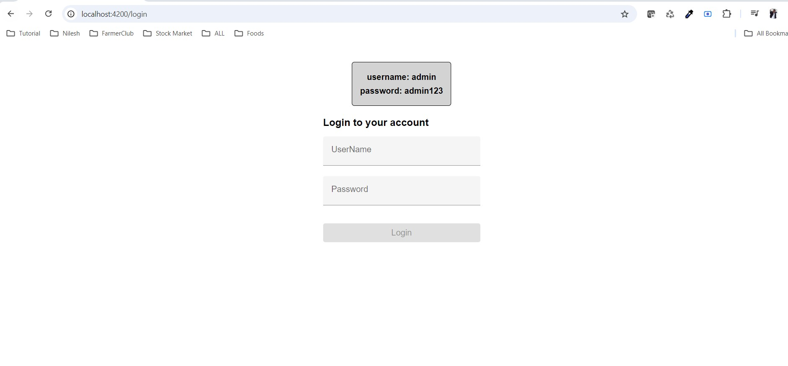
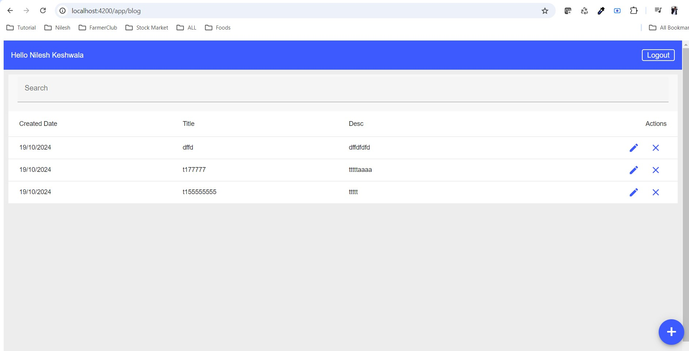
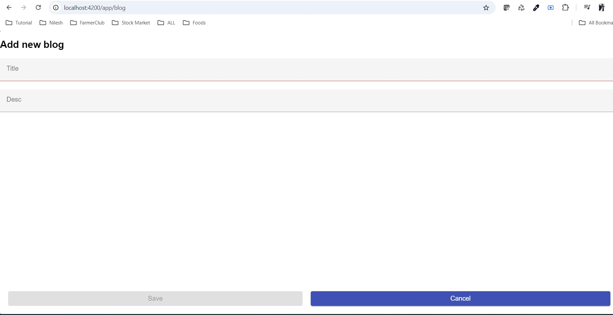

# BlogManagementApplication Angular 18 example project

# Development server
Open project in VS code then Run "npm instal" command in the termingal and then run "ng serve" to run a project and server port should be the 4200 and Navigate to http://localhost:4200/. 

